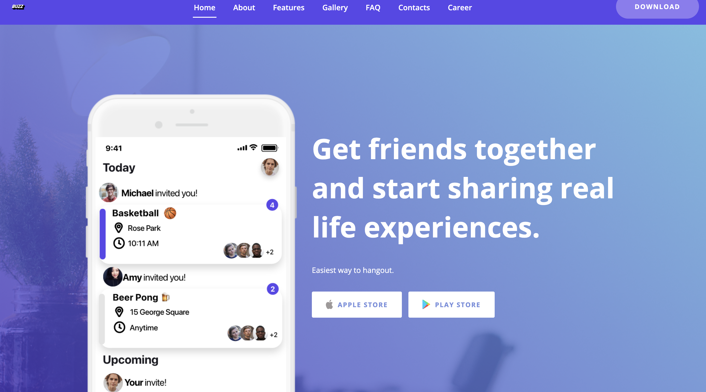
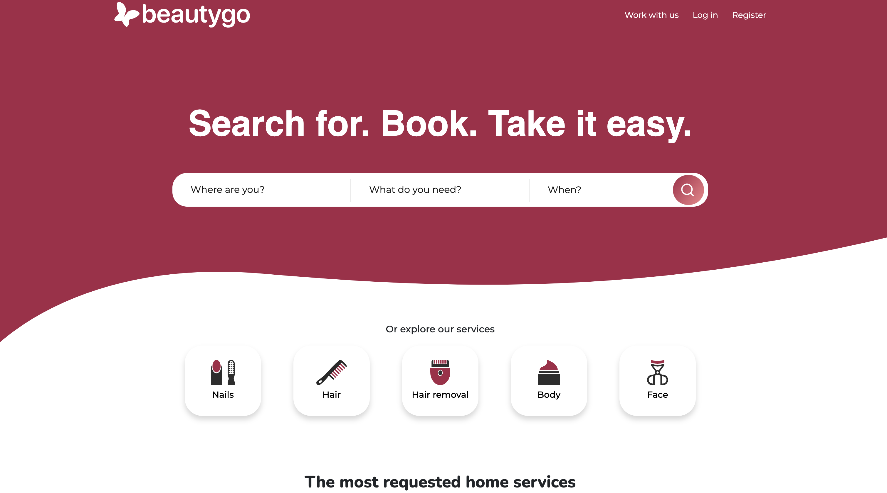
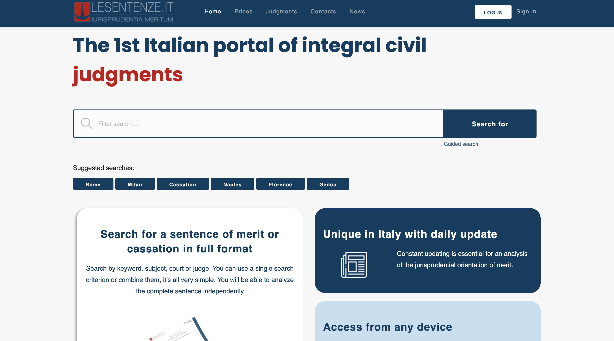

<h1 align="center"> Hi 👋, it is great to have you here!  </h1> 

## 🚀 About Me

🎓 I am Davide Pollicino, an Lab Assistant at [**Edinburgh Napier University**](https://www.napier.ac.uk/), incoming **Software Engineer at Microsoft** and **Software Engineer Manager** at [**Getbuzz**](http://getbuzz.uk/). I am also Pursuing my Bachelor in **Computer Science** and will graduate in mid-2022.

Graduated at ITIS Vittorio Emanuele III (IT & Telecommunications school): 93% (A);

🧑🏻‍💻 Ex SWE intern [@Microsoft](https://github.com/microsoft/), ex Tech Lead at NDWebSolutions.

🤝 I’m looking for flutter developer, and Django developer to join us at BuzzUk, visit our [career website](https://getbuzzuk.notion.site/Buzz-Career-5ec923e938ea4f1da50f356f2c86312f).

📝 I often write articles on [medium](https://davidepollicino.medium.com/)

🎬 Favorite film: [Piccolo Cinema Paradiso (Small Cinema Paradise)](https://en.wikipedia.org/wiki/Cinema_Paradiso)

## 🏅 Achievements
 🤝 Microsoft campus Ambassador (2021).
 
 🥇 1rst in GeeksForGeeks Edinburgh Napier University coding ranks. 
 
 💪GeeksForGeeks Campus Ambassador (2020). 
 
 🏆 1rst classified at regional level in National Competitive Programming in team, HBFS TEAM (Italy 2016-2017);
 
 ⭐ 28th Among 700+ teams in National Competitive Programming in team, HBFS TEAM (Italy 2016-2017)

# Experienced in startups environment 

* [Getbuzz.uk](http://getbuzz.uk/): building next messaging application
* [Beautygo.it](https://beautygo.it/): booking system for beauty services offered by hair stylists, barber shops and beauty salons in Italy.
* [icoinqui.it](https://icoinqui.it/): real-estate renting platform that allows to review both landlord and flatmates, 
after have found your new home!
 
 
 

# Company rebranding, product maintenance and growth operations #
* [FrontOfClass.co.uk](https://frontofclass.co.uk/): Leading recruiting company for education in the United Kingdom. 
* [Lesentenze.it](https://www.lesentenze.it/): Leading italian source for court legal sentences view, with over **one million** of montly
sentences searches. 

 

# Competitive Coding Profile #
	

	

	
	

# 🔗 Links #

